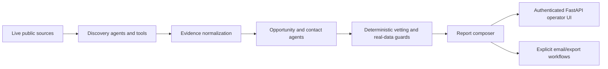

# Business Intel: Engineering Overview

Business Intel is an evidence-grounded multi-agent system for discovering, validating, ranking, and composing public-signal sales intelligence. It combines Google ADK agents, deterministic data controls, a FastAPI operator surface, and report-generation workflows without allowing model output to masquerade as verified evidence.

## At a glance

| Area | Implementation |
| --- | --- |
| Core stack | Python, Google ADK, FastAPI, Pydantic, public-source tooling, structured report generation |
| Agent lanes | Sri Lanka trigger leads, contact resolution, opportunity analysis, UK/IE Dynamics 365 intelligence |
| Trust model | Real-data-only policy, source provenance, live verification flags, tender rejection, explicit delivery gates |
| Operator surface | Authenticated local web application plus command-line smoke and evaluation tools |
| Quality strategy | Ruff, ty, codespell, deterministic pytest coverage, evalsets, and explicit live-smoke boundaries |

## Why this project is technically interesting

- **Models do not own truth.** Every accepted lead retains its source URL, excerpt, source name, fetch time, and live-verification state.
- **Specialists compose a pipeline.** Discovery, extraction, contact resolution, opportunity analysis, vetting, reporting, and email delivery are independent agent/tool boundaries.
- **Policy is executable.** Synthetic companies, fake URLs, unsupported claims, and tender-only signals are rejected by runtime guards and tests.
- **Delivery is controlled.** Gmail and cloud operations use explicit configuration and smoke-test paths rather than silent side effects.

## System shape

## Guided code tour

1. **`sl_trigger_leads/`** — Sri Lanka public-signal agents, source tooling, contact resolution, analysis, and guarded delivery.
2. **`uk_ie_d365_leads/`** — Dynamics 365 discovery, extraction, classification, vetting, and report composition.
3. **`frontend/`** — authenticated local operator application with storage and refresh controls.
4. **`tools/`** — bounded smoke, measurement, vetting, recovery, and report-production entry points.
5. **`tests/`** — unit, integration, evaluation, compatibility, authentication, and real-data policy coverage.
6. **`REAL_DATA_POLICY.md`** — the non-negotiable evidence contract for runtime leads.

## Engineering decisions worth discussing

### Evidence before enrichment

The system carries provenance through the pipeline so downstream analysis can be traced back to a real public observation.

### Agent specialization with deterministic gates

LLMs handle ambiguous interpretation and composition; Python contracts decide whether evidence is complete enough to proceed.

### Local-first operational control

The application can be evaluated without exposing a public service. Authentication, cookie security, refresh throttling, and deployment notes make the boundary explicit.

## Verification

The deterministic repository gates are:

- `uv lock --check`;
- `uv pip check`;
- `uv run ruff check .`;
- `uv run ty check`;
- `uv run codespell`;
- `uv run pytest`;
- JavaScript syntax checks for both frontend scripts;
- a wheel build and inventory check confirming that static assets are present and runtime data, logs, evidence, environment files, and internal tests are absent.

Live-provider evaluation, deployment checks, dependency audits, and secret scans
remain separate release gates because they can require credentials, incur cost, or
serve a different assurance purpose.

## For coding agents

1. Read `AGENTS.md`, `REAL_DATA_POLICY.md`, and the relevant lane documentation first.
2. Never emit synthetic leads or unverifiable URLs.
3. Preserve provenance fields through every transformation.
4. Keep tender/procurement-only signals rejected unless the product scope changes explicitly.
5. Treat live provider delivery as a separately verified operation.

## Current boundaries

- The system is local-first; a deployment guide is not proof of a live production deployment.
- Real provider, Gmail, and cloud operations require external authentication and were not exercised by the offline test suite.
- Generated lead reports can contain commercially sensitive public intelligence and are intentionally excluded from this source release.

## What this repository demonstrates

Business Intel demonstrates practical multi-agent engineering: specialist orchestration, evidence-grounded AI, deterministic safety gates, authenticated operator tooling, evaluation discipline, and report workflows designed for real commercial use.
